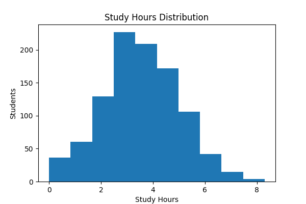
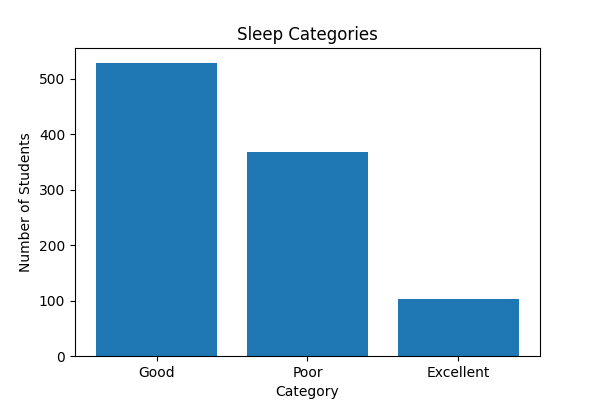
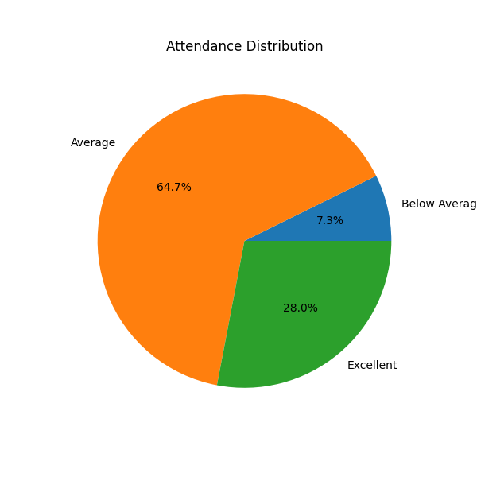
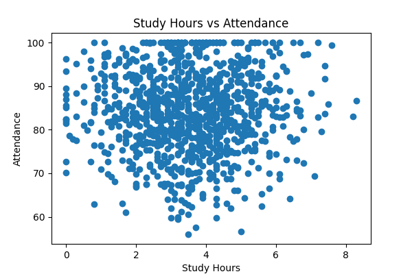
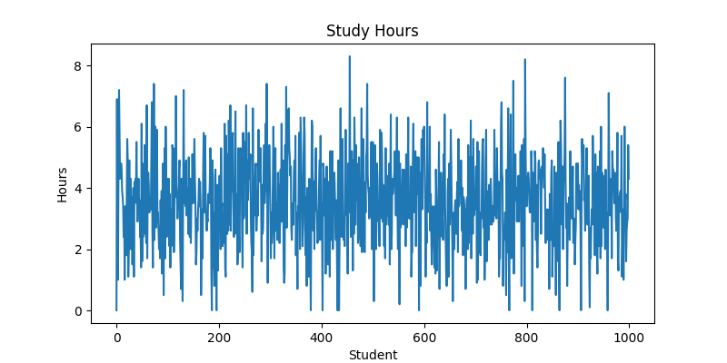

# 📊 AI-Based Student Routine & Productivity Analyzer

## 📌 Project Overview
This project analyzes student daily routines using Python.

It uses:
- NumPy
- Pandas
- Matplotlib

## ✨ Features
- Data Cleaning
- Missing Value Handling
- Duplicate Removal
- Productivity Score Calculation
- Study Efficiency Analysis
- Sleep Category Analysis
- Data Visualization

## 📂 Dataset
Student Habits Performance Dataset

## 🛠 Technologies Used
- Python
- NumPy
- Pandas
- Matplotlib
- Google Colab

## 📈 Visualizations
- Histogram
- Bar Chart
- Pie Chart
- Scatter Plot
- Line Chart
## 📊 Project Visualizations

### Study Hours Distribution

### Sleep Categories

### Attendance Distribution

### Study Hours vs Attendance

### Study Hours Line Chart

## 👩‍💻 Author
Ananya Yadav
